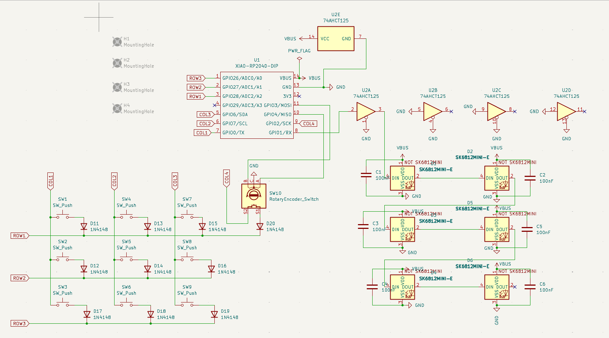
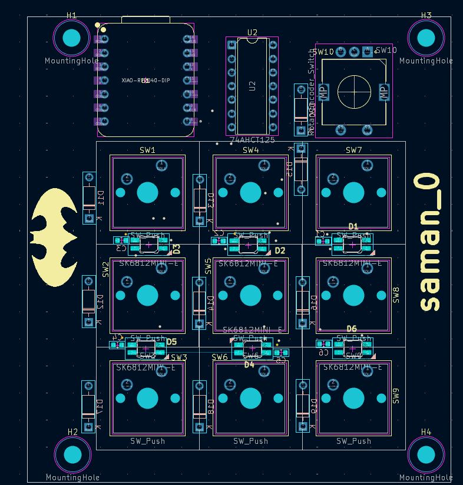
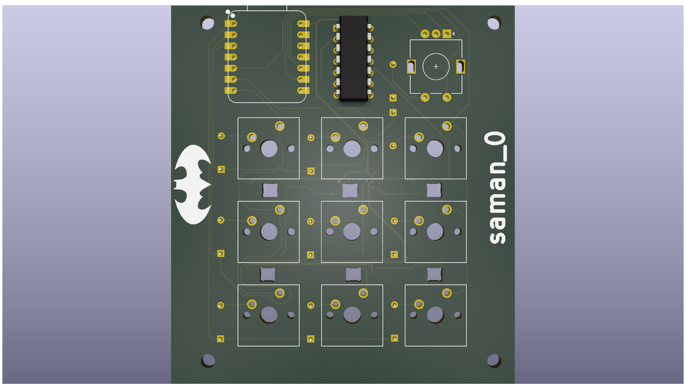
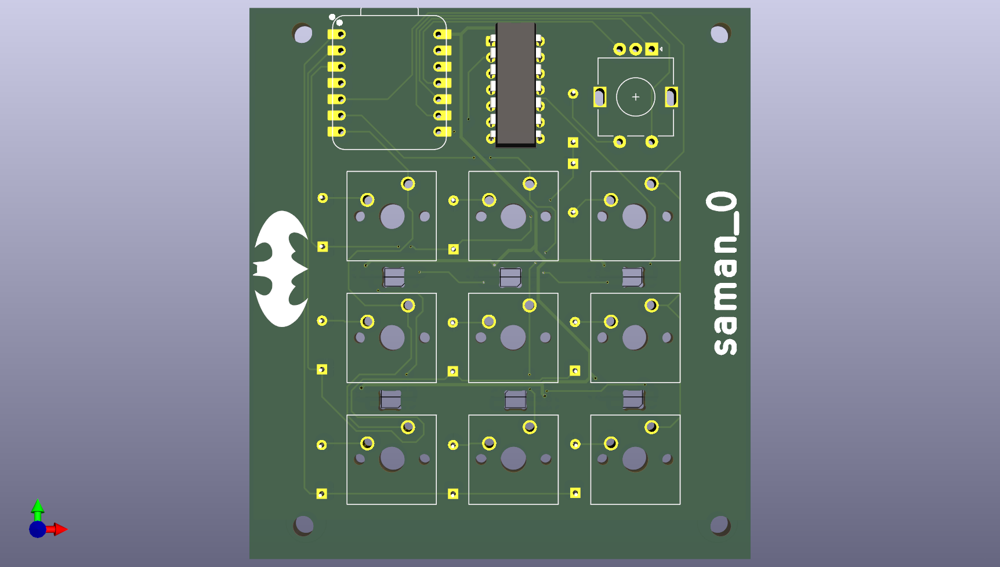
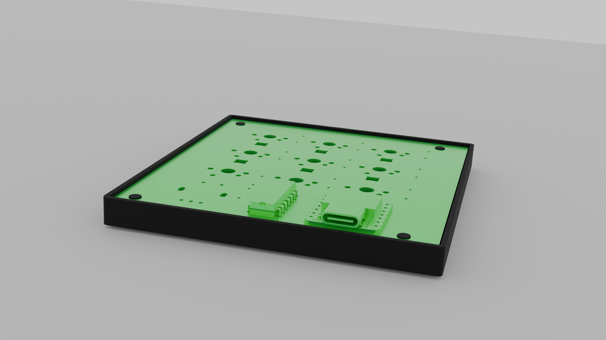
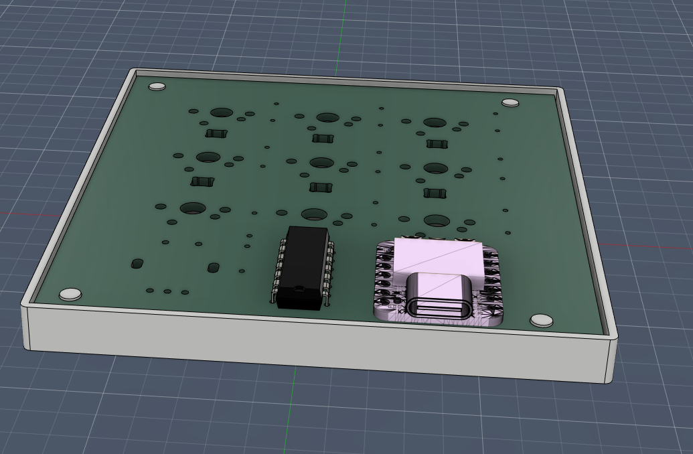

# My MacroPad Project

## 📁 Project Structure

- **[KiCAD_project/](KiCAD_project/)** 
  - `KiCAD_project.kicad_pcb` 
  - `KiCAD_project.kicad_sch` 
  - `KiCAD_project.kicad_pro` 
  - **[output/](KiCAD_project/output/)** 
  - **[OPL_Kicad_Library-master/](KiCAD_project/OPL_Kicad_Library-master/)**
  - **[kicad-libraries-master/](KiCAD_project/kicad-libraries-master/)** 
  - **[kicad_care_package/](KiCAD_project/kicad_care_package/)** 
  - **[KiCAD_project-backups/](KiCAD_project/KiCAD_project-backups/)** 

- **[CAD/](CAD/)** 
  - `3d_PCB.step` 
  - `housing.stl` 
  - `pcb_only.stl` 
  - `With-PCB_for-render.stl` 
  - `Seeed Studio XIAO RP2040.stl` 
  - **[blender/](CAD/blender/)** 

- **[KiCAD_project/My macroPad-bom.csv](KiCAD_project/My%20macroPad-bom.csv)** - BOM

## Design images

### Schematic

### PCB Layout

### 3D Renderings

#### Rendered PCB

#### PCB without rendering

#### Rendered Housing for PCB

#### Housing for PCB (screenshot from fusion360)

Project Link: https://stasis.hackclub.com/dashboard/projects/cmosrdxum001301mxc1tzjn15
